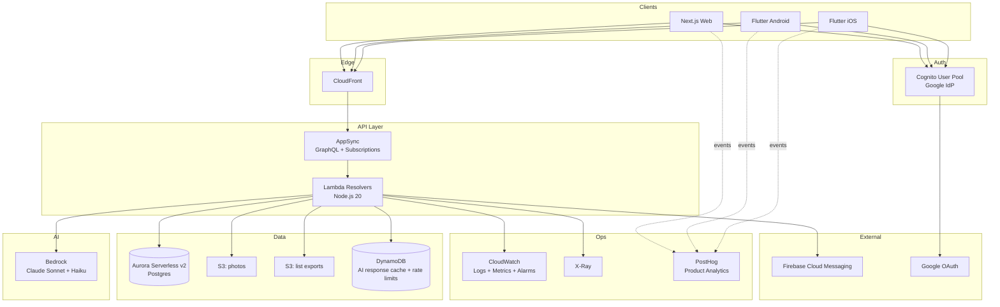
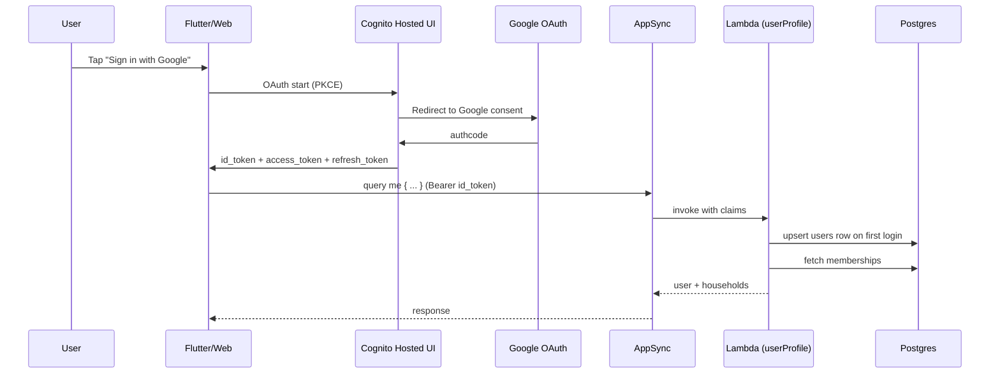
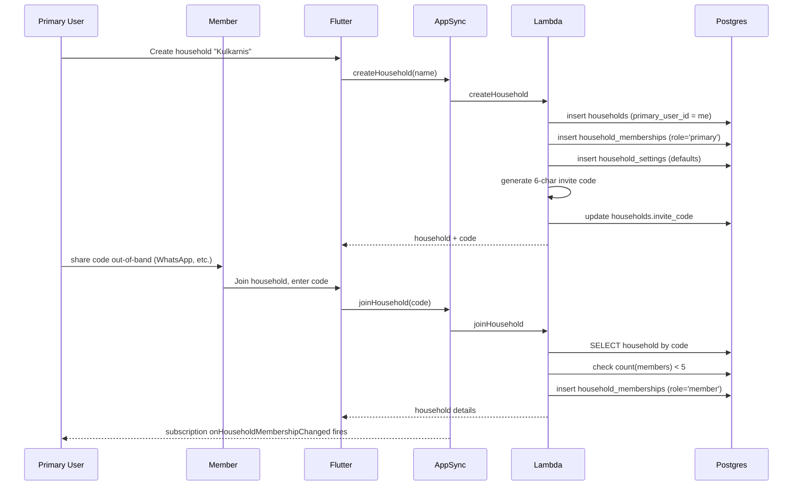
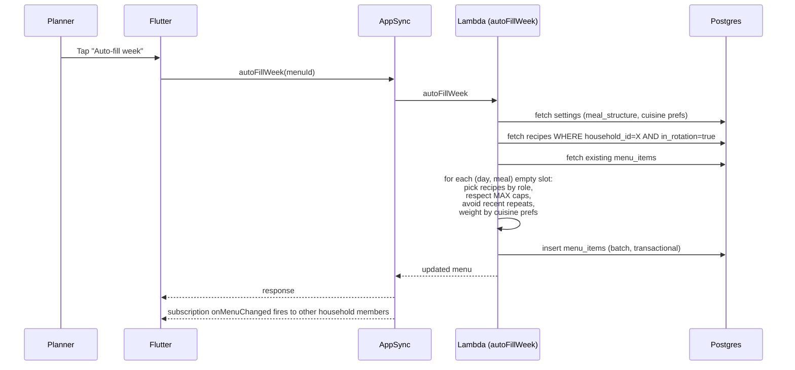
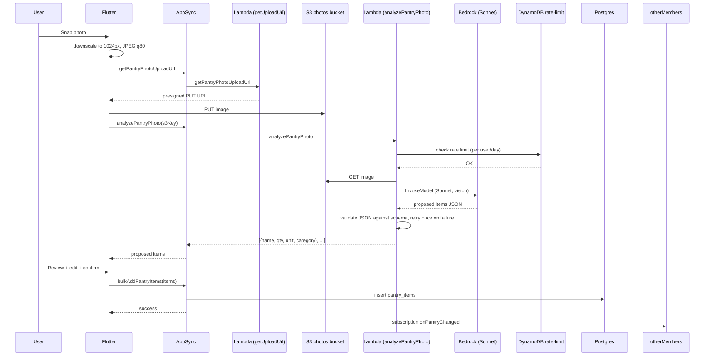
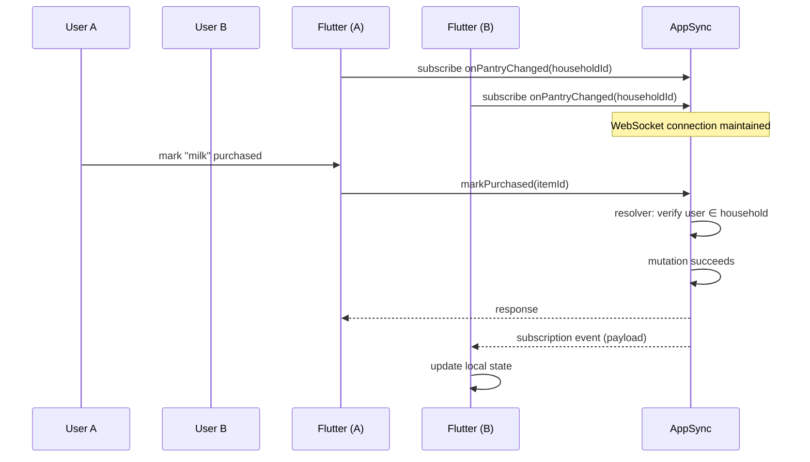
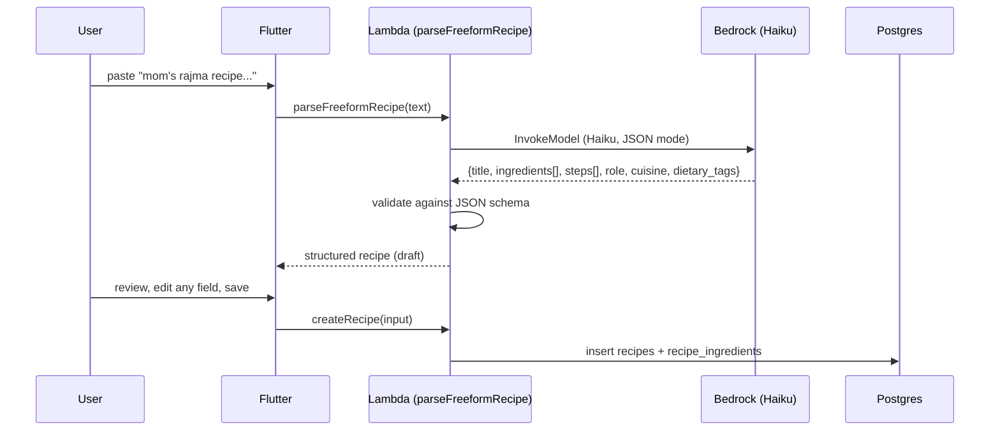
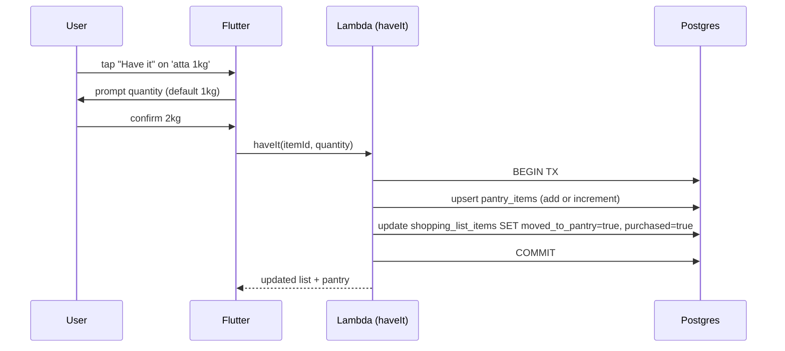

# Parimaan — System Design

**Version:** 0.1
**Owner:** Amogh Kulkarni
**Last updated:** 2026-07-29
**Status:** Draft — pending review
**Companion to:** [PRD v0.3](./PRD.md)

---

## 1. Overview

This document turns the PRD into a buildable system: how the pieces fit together, what talks to what, what's stored where, what fails when things go wrong, and what a solo developer actually deploys.

Design goals, in priority order:

1. **Correctness under multi-user editing.** Households share data live; two people writing to the same shopping list must not lose data.
2. **Cost discipline.** Every choice is measured against §17 of the PRD (~$25–35/mo at beta scale).
3. **Solo-developer operability.** Nothing here should require a 24×7 on-call rotation. Prefer managed services and generous timeouts.
4. **Room to grow.** The schema and API should survive v1.1 (roles, ingredient normalization, receipt OCR) without rewrites.

---

## 2. Baseline decisions (flag to push back before we bake these in)

| Decision | Choice | Alternative | Reason |
|---|---|---|---|
| **AWS region** | `ap-south-1` (Mumbai) primary | `us-east-1` | Data residency for India-first users; ~30ms latency wins for beta households. |
| **Bedrock region** | `ap-south-1` if Claude models available; else `us-east-1` cross-region | Direct Anthropic API | Verify model availability first week of month 5. |
| **Environments** | `dev` + `prod` only | + `staging` | Solo dev overhead; use feature flags in prod for staged rollout. |
| **Repo layout** | Monorepo | Multi-repo | Shared types between Flutter, web, and Lambda; easier atomic changes. |
| **Backend runtime** | Node.js 20 + TypeScript on Lambda | Python | Type sharing with web + shared validation schemas. |
| **IaC** | AWS CDK v2 in TypeScript | SAM, Terraform | Same language as Lambda; per-construct testability. |
| **CI/CD** | GitHub Actions | CodePipeline | Free tier, familiar. |
| **DB migrations** | `node-pg-migrate` | Prisma Migrate, Sqitch | Lightweight, no ORM lock-in. |
| **GraphQL client (Flutter)** | `ferry` (codegen) | `graphql_flutter` | Type-safe generated Dart from SDL. |
| **GraphQL client (web)** | `urql` | Apollo Client | Smaller bundle, subscriptions supported. |
| **Push notifications** | FCM (Firebase Cloud Messaging) | AWS Pinpoint | FCM is free; Pinpoint charges. |

Push back on any of these before we bake them into CDK stacks in month 1.

---

## 3. Architecture at a glance



---

## 4. Component responsibilities

| Component | Responsibility | Not responsible for |
|---|---|---|
| **Flutter mobile** | UI, local read-cache, image compression, GraphQL calls, FCM registration | Auth token issuance, business logic beyond field validation |
| **Next.js web** | Read + limited edit UI, household admin, mirror of GraphQL API | Real-time meal-plan editing (v1.1) |
| **Cognito** | User authentication via Google, JWT issuance, token refresh | Household membership, authorization decisions |
| **AppSync** | GraphQL entrypoint, subscription fanout, JWT validation, resolver invocation | Business logic |
| **Lambda resolvers** | Query/mutation logic, authorization checks (householdId ∈ user's memberships), Bedrock calls, DB writes, S3 presigned URLs | UI concerns |
| **Aurora Postgres** | System of record for all household data | Blob storage, cache |
| **S3 (photos)** | Pantry/recipe photo storage, uploaded via presigned URLs | List image generation (that's Lambda) |
| **S3 (exports)** | Generated shopping list images, 30-day lifecycle | |
| **DynamoDB** | AI response cache (TTL), per-user AI rate limits | Anything relational |
| **Bedrock** | Claude Sonnet (vision + complex text), Claude Haiku (freeform parse, staples note) | Prompt storage — prompts live in code |
| **FCM** | Push delivery to iOS + Android | Notification preferences (those live in Postgres) |
| **PostHog** | Product analytics, feature flags, session replay | Auth, business data |
| **CloudWatch + X-Ray** | Logs, metrics, distributed traces, alarms | Application-level debugging tools |

---

## 5. Key data flows

### 5.1 Auth — Google SSO via Cognito



Notes:
- First login triggers user row creation server-side (Cognito holds identity; our `users` table holds display data).
- Refresh happens transparently via Cognito SDK.
- No password path in MVP; only Google IdP is configured.

### 5.2 Household create → invite → join



### 5.3 Weekly meal plan generation



### 5.4 Photo pantry AI



### 5.5 Real-time household sync



**Subscription strategy:**
- One subscription topic per (household, entity-type): `onPantryChanged(householdId)`, `onMenuChanged(householdId)`, `onShoppingListChanged(householdId)`, `onSettingsChanged(householdId)`
- Client subscribes on foreground, unsubscribes on background
- Reconnect with backoff on drop; on reconnect, re-fetch full state

### 5.6 Freeform recipe parse



### 5.7 "Have it" during shopping list review



---

## 6. AppSync GraphQL API

### 6.1 Schema (SDL, MVP subset)

```graphql
scalar AWSDateTime
scalar AWSJSON
scalar AWSDate

# ---------- Types ----------

type User {
  id: ID!
  email: String!
  displayName: String
  avatarUrl: String
  households: [HouseholdMembership!]!
}

type Household {
  id: ID!
  name: String!
  inviteCode: String!
  primaryUserId: ID!
  members: [HouseholdMembership!]!
  settings: HouseholdSettings!
  subscriptionStatus: SubscriptionStatus!
}

type HouseholdMembership {
  id: ID!
  household: Household!
  user: User!
  role: HouseholdRole!
  joinedAt: AWSDateTime!
}

enum HouseholdRole { primary member }
enum SubscriptionStatus { free trial active past_due cancelled }

type HouseholdSettings {
  householdId: ID!
  mealsEnabled: [MealType!]!
  mealStructure: AWSJSON!   # {lunch: {carb: 1, sabzi_dal: 2, accompaniment: 1}, ...}
  cuisineTier1: [CuisineTier1!]!
  cuisineTier2Weights: AWSJSON! # {punjabi: "more", ...}
  dietaryTags: [DietaryTag!]!
  allergens: [String!]!
  skipIngredients: [String!]!
}

enum MealType { breakfast lunch snacks dinner }
enum CuisineTier1 { north_indian south_indian pan_india indo_chinese continental }
enum DietaryTag { veg vegan jain eggetarian gluten_free dairy_free }
enum RecipeRole { breakfast carb sabzi_dal accompaniment snack sweet drink }
enum RecipeSource { user url curated ai freeform_ai }

type Recipe {
  id: ID!
  householdId: ID!
  sourceType: RecipeSource!
  sourceUrl: String
  title: String!
  description: String
  servings: Int!
  prepMin: Int
  cookMin: Int
  cuisineTier1: CuisineTier1
  cuisineTier2: String
  dietaryTags: [DietaryTag!]!
  role: RecipeRole!
  inRotation: Boolean!
  isFavorite: Boolean!
  # Resolved by a separate field resolver (W6 S2, E2E_MVP_PLAN.md §12.2.7) —
  # Query.recipes never hydrates this inline, so a Library-style query that
  # doesn't select it never pays for the join. RLS is the sole
  # authorization layer here (no householdId argument to gate on).
  ingredients: [RecipeIngredient!]!
  steps: [String!]!
  # Added W6 S2 (§12.2.8) — this block originally had neither field.
  createdAt: AWSDateTime!
  updatedAt: AWSDateTime!
}

type RecipeIngredient {
  id: ID!
  name: String!
  quantity: Float
  unit: String
  category: String
  notes: String
  isStaple: Boolean!
}

type PantryItem {
  id: ID!
  householdId: ID!
  name: String!
  quantity: Float!
  unit: String!
  category: String
  isStaple: Boolean!
  # AWSDate, not AWSDateTime (deviation, W5 S2 — E2E_MVP_PLAN.md §11.2.5):
  # the underlying column is a plain SQL DATE, and AWSDateTime would attach
  # a spurious time-of-day and timezone no user chose.
  expiryDate: AWSDate
  lowThreshold: Float
  addedBy: ID!
  addedAt: AWSDateTime!
  updatedAt: AWSDateTime!
}

# No `addedBy` field — always the verified caller, never client-supplied
# (W5 S2).
input PantryItemInput {
  name: String!
  quantity: Float!
  unit: String!
  category: String
  isStaple: Boolean
  expiryDate: AWSDate
  lowThreshold: Float
}

type Menu {
  id: ID!
  householdId: ID!
  weekStartDate: AWSDateTime!
  items: [MenuItem!]!
}

type MenuItem {
  id: ID!
  menuId: ID!
  recipe: Recipe!
  dayOfWeek: Int!
  mealSlot: MealType!
  slotRole: RecipeRole!
  servingsOverride: Int
  madeAt: AWSDateTime
}

type ShoppingList {
  id: ID!
  householdId: ID!
  generatedFromMenuId: ID
  createdAt: AWSDateTime!
  closedAt: AWSDateTime
  aiStaplesNote: String
  items: [ShoppingListItem!]!
}

type ShoppingListItem {
  id: ID!
  name: String!
  quantity: Float
  unit: String
  category: String
  sourceRecipeId: ID
  purchased: Boolean!
  purchasedBy: ID
  purchasedAt: AWSDateTime
  movedToPantry: Boolean!
}

# ---------- Queries ----------

type Query {
  me: User!
  household(id: ID!): Household!
  pantry(householdId: ID!, search: String, category: String): [PantryItem!]!
  recipes(householdId: ID!, role: RecipeRole, isFavorite: Boolean): [Recipe!]!
  menu(householdId: ID!, weekStartDate: AWSDateTime!): Menu
  shoppingList(householdId: ID!, id: ID): ShoppingList
  cookFromPantry(householdId: ID!, vibe: String): [Recipe!]!   # AI
}

# ---------- Mutations ----------

type Mutation {
  # Household
  createHousehold(name: String!): Household!
  joinHousehold(inviteCode: String!): Household!
  rotateInviteCode(householdId: ID!): Household!
  leaveHousehold(householdId: ID!): Boolean!
  updateHouseholdSettings(householdId: ID!, input: HouseholdSettingsInput!): HouseholdSettings!

  # Pantry
  addPantryItem(householdId: ID!, input: PantryItemInput!): PantryItem!
  bulkAddPantryItems(householdId: ID!, items: [PantryItemInput!]!): [PantryItem!]!
  # PantryItemPatchInput (not PantryItemInput — its fields are all required,
  # wrong for a partial patch), and returns PantryItem!, not Boolean!
  # (W5 S3, E2E_MVP_PLAN.md §11.2.1) — a future onPantryChanged subscriber
  # needs to know *which* item vanished on delete, not just that a delete
  # happened somewhere. Neither mutation takes householdId; the item's
  # household is discovered from `id` via a query already RLS-scoped to the
  # caller's own households (see api/src/resolvers/updatePantryItem.ts).
  updatePantryItem(id: ID!, input: PantryItemPatchInput!): PantryItem!
  deletePantryItem(id: ID!): PantryItem!

  # Recipes. Not yet shipped as of W6 S2 (Query.recipes + Recipe.ingredients
  # only) — signatures below are locked (E2E_MVP_PLAN.md §12.7 D3) ahead of
  # implementation (W6 S3/S4/S5), so this SD block matches what actually
  # ships rather than the schema module's own original draft:
  # `updateRecipe` takes `RecipePatchInput!`, not `RecipeInput!` (a partial
  # patch, matching `updatePantryItem`'s convention — reusing the create
  # input was wrong for the same reason `PantryItemPatchInput` exists at
  # all); `deleteRecipe` returns `Recipe!`, not `Boolean!` (so a subscriber
  # learns which recipe vanished, matching `deletePantryItem`'s §11.2.1
  # precedent).
  createRecipe(householdId: ID!, input: RecipeInput!): Recipe!
  updateRecipe(id: ID!, input: RecipePatchInput!): Recipe!
  deleteRecipe(id: ID!): Recipe!
  favoriteRecipe(id: ID!, favorite: Boolean!): Recipe!
  setInRotation(id: ID!, inRotation: Boolean!): Recipe!
  importRecipeFromUrl(householdId: ID!, url: String!): Recipe!            # returns draft, requires confirm
  parseFreeformRecipe(householdId: ID!, text: String!): Recipe!           # AI, returns draft
  analyzePantryPhoto(householdId: ID!, s3Key: String!): [PantryItemInput!]! # AI

  # Menu
  createMenu(householdId: ID!, weekStartDate: AWSDateTime!): Menu!
  addMenuItem(menuId: ID!, input: MenuItemInput!): MenuItem!
  removeMenuItem(id: ID!): Boolean!
  autoFillWeek(menuId: ID!, overwrite: Boolean!): Menu!
  markMade(menuItemId: ID!): MenuItem!

  # Shopping list
  generateShoppingList(menuId: ID!): ShoppingList!
  addShoppingListItem(listId: ID!, input: ShoppingListItemInput!): ShoppingListItem!
  markPurchased(itemId: ID!): ShoppingListItem!
  haveIt(itemId: ID!, quantity: Float!): ShoppingListItem!
  exportShoppingListImage(listId: ID!): String!    # returns presigned URL

  # Upload URL
  getPantryPhotoUploadUrl(householdId: ID!): PresignedUpload!
}

type PresignedUpload {
  url: String!
  s3Key: String!
  expiresAt: AWSDateTime!
}

# ---------- Subscriptions ----------

type Subscription {
  # This list was originally 6 mutations, 3 of which can't compile as an
  # AppSync subscription: a subscribed mutation's return type must be a
  # supertype of the subscription payload, and `bulkAddPantryItems` returns
  # `[PantryItem!]!` (a list can't fan out to one `PantryItem`), while
  # `haveIt`/`markPurchased` return `ShoppingListItem!` (wrong type, and
  # don't exist yet — W11/W12). Corrected per E2E_MVP_PLAN.md §11.2.1;
  # `bulkAddPantryItems`' own subscription coverage (`onPantryBulkChanged`
  # or a refetch) is an open W18 item, not solved here.
  #
  # `onPantryChanged` **is implemented** (W5 S8) — the first field in this
  # type to go live, authorized by a per-field Lambda resolver rather than
  # this section's stated connect-time authorizer (§10.4 deviation,
  # E2E_MVP_PLAN.md §11.2.9). `onMenuChanged`/`onShoppingListChanged`/
  # `onHouseholdChanged` below remain aspirational (`onHouseholdChanged`
  # deferred to W8; the other two to W11/W12, alongside the mutations they
  # subscribe to). The pushed payload carries no event-type discriminator —
  # see E2E_MVP_PLAN.md §11.2.12 for why the mobile client treats every push
  # as "refetch", not a local add/update/delete patch — the same constraint
  # applies to every subscription field in this type, not just this one.
  onPantryChanged(householdId: ID!): PantryItem
    @aws_subscribe(mutations: ["addPantryItem", "updatePantryItem", "deletePantryItem"])

  onMenuChanged(householdId: ID!): Menu
    @aws_subscribe(mutations: [
      "createMenu", "addMenuItem", "removeMenuItem",
      "autoFillWeek", "markMade"
    ])

  onShoppingListChanged(householdId: ID!): ShoppingList
    @aws_subscribe(mutations: [
      "generateShoppingList", "addShoppingListItem",
      "markPurchased", "haveIt"
    ])

  onHouseholdChanged(householdId: ID!): Household
    @aws_subscribe(mutations: [
      "updateHouseholdSettings", "rotateInviteCode",
      "joinHousehold", "leaveHousehold"
    ])
}

# input types omitted for brevity — mirror the Type shapes, EXCEPT where
# `shared/schema.graphql` (the single source of truth once a slice actually
# ships) deliberately diverges: `RecipeInput`/`RecipeIngredientInput`/
# `RecipePatchInput` (W6 S2, E2E_MVP_PLAN.md §12.7 D3) omit every
# server-owned field (`id`, `householdId`, `sourceType`, `isFavorite`,
# `createdAt`/`updatedAt`) that a literal mirror of `Recipe`/
# `RecipeIngredient` would otherwise expose to the client.
```

### 6.2 Authorization

- **Layer 1 (AppSync):** `AMAZON_COGNITO_USER_POOLS` default; all queries/mutations require a valid Cognito JWT.
- **Layer 2 (Lambda resolvers):** every resolver receives the caller's `userId` in the identity context. First step of every resolver: verify `userId` is a member of the target `householdId`.
- **Layer 3 (Postgres RLS):** row-level security policies gate every table by `household_id`. Even if a resolver is buggy, the DB refuses to leak.
- **Subscription authorization:** custom Lambda authorizer on subscription connect validates the subscriber is a member of the requested `householdId`.

### 6.3 Resolver → data-source routing

| Resolver | Data source |
|---|---|
| Simple CRUD (pantry, recipes, menu, list) | Aurora Postgres via RDS Data API or direct connection |
| Auto-fill, generate shopping list, "cook from pantry" | Aurora + business logic in Lambda |
| Photo pantry, freeform parse, staples note | Bedrock via SDK |
| Upload URLs | S3 SDK |
| Export list image | Lambda uses `sharp` or similar to render, upload to `parimaan-exports`, return presigned URL |

**Aurora connection strategy:** use RDS Proxy in front of Aurora to pool connections (Lambda invocations otherwise open too many). Data API is an alternative but has higher per-call latency.

---

## 7. Data storage

### 7.1 Postgres schema (deployable DDL)

```sql
-- Extensions
CREATE EXTENSION IF NOT EXISTS pgcrypto;
CREATE EXTENSION IF NOT EXISTS "uuid-ossp";

-- Users (mirror of Cognito identities)
CREATE TABLE users (
  id UUID PRIMARY KEY DEFAULT gen_random_uuid(),
  cognito_sub TEXT UNIQUE NOT NULL,
  email TEXT UNIQUE NOT NULL,
  display_name TEXT,
  avatar_url TEXT,
  created_at TIMESTAMPTZ NOT NULL DEFAULT NOW()
);

CREATE INDEX idx_users_cognito_sub ON users(cognito_sub);

-- Households
CREATE TABLE households (
  id UUID PRIMARY KEY DEFAULT gen_random_uuid(),
  name TEXT NOT NULL,
  invite_code TEXT UNIQUE NOT NULL,
  primary_user_id UUID NOT NULL REFERENCES users(id),
  subscription_status TEXT NOT NULL DEFAULT 'free'
    CHECK (subscription_status IN ('free','trial','active','past_due','cancelled')),
  plan_id TEXT,
  stripe_customer_id TEXT,
  created_at TIMESTAMPTZ NOT NULL DEFAULT NOW()
);

CREATE INDEX idx_households_invite_code ON households(invite_code);

-- Household settings
CREATE TABLE household_settings (
  household_id UUID PRIMARY KEY REFERENCES households(id) ON DELETE CASCADE,
  meals_enabled JSONB NOT NULL DEFAULT '["breakfast","lunch","dinner"]',
  meal_structure JSONB NOT NULL DEFAULT '{"lunch":{"carb":1,"sabzi_dal":2,"accompaniment":1},"dinner":{"carb":1,"sabzi_dal":2,"accompaniment":1}}',
  cuisine_tier1 JSONB NOT NULL DEFAULT '["north_indian"]',
  cuisine_tier2_weights JSONB NOT NULL DEFAULT '{}',
  dietary_tags JSONB NOT NULL DEFAULT '[]',
  allergens JSONB NOT NULL DEFAULT '[]',
  skip_ingredients JSONB NOT NULL DEFAULT '[]',
  updated_at TIMESTAMPTZ NOT NULL DEFAULT NOW()
);

-- Memberships
CREATE TABLE household_memberships (
  id UUID PRIMARY KEY DEFAULT gen_random_uuid(),
  household_id UUID NOT NULL REFERENCES households(id) ON DELETE CASCADE,
  user_id UUID NOT NULL REFERENCES users(id) ON DELETE CASCADE,
  role TEXT NOT NULL CHECK (role IN ('primary','member')),
  joined_at TIMESTAMPTZ NOT NULL DEFAULT NOW(),
  UNIQUE(household_id, user_id)
);

CREATE INDEX idx_memberships_user ON household_memberships(user_id);
CREATE INDEX idx_memberships_household ON household_memberships(household_id);

-- Recipes
-- W6 S1 (E2E_MVP_PLAN.md §12.2.6/§12.2.8) deviates from this DDL as
-- originally drafted in three places, all additive: `updated_at` (below —
-- this block only had `created_at` before), a CHECK on `cuisine_tier1`
-- (§12.2.6 — an unrecognised value here would fail to serialize the
-- *entire* `Query.recipes` response, not just one field, since it's a
-- closed GraphQL enum), and RLS on `recipe_ingredients` (see the RLS block
-- below — this table was never in the original RLS list at all, despite
-- having no `household_id` of its own).
CREATE TABLE recipes (
  id UUID PRIMARY KEY DEFAULT gen_random_uuid(),
  household_id UUID NOT NULL REFERENCES households(id) ON DELETE CASCADE,
  source_type TEXT NOT NULL CHECK (source_type IN ('user','url','curated','ai','freeform_ai')),
  source_url TEXT,
  source_raw_text TEXT,
  title TEXT NOT NULL,
  description TEXT,
  servings INT NOT NULL DEFAULT 4,
  prep_min INT,
  cook_min INT,
  cuisine_tier1 TEXT CHECK (cuisine_tier1 IS NULL OR cuisine_tier1 IN ('north_indian','south_indian','pan_india','indo_chinese','continental')),
  cuisine_tier2 TEXT,
  dietary_tags JSONB NOT NULL DEFAULT '[]',
  role TEXT NOT NULL CHECK (role IN ('breakfast','carb','sabzi_dal','accompaniment','snack','sweet','drink')),
  in_rotation BOOLEAN NOT NULL DEFAULT TRUE,
  is_favorite BOOLEAN NOT NULL DEFAULT FALSE,
  steps JSONB NOT NULL DEFAULT '[]',
  created_by UUID NOT NULL REFERENCES users(id),
  created_at TIMESTAMPTZ NOT NULL DEFAULT NOW(),
  updated_at TIMESTAMPTZ NOT NULL DEFAULT NOW()
);

CREATE INDEX idx_recipes_household ON recipes(household_id);
CREATE INDEX idx_recipes_role ON recipes(household_id, role) WHERE in_rotation = TRUE;

CREATE TABLE recipe_ingredients (
  id UUID PRIMARY KEY DEFAULT gen_random_uuid(),
  recipe_id UUID NOT NULL REFERENCES recipes(id) ON DELETE CASCADE,
  name TEXT NOT NULL,
  quantity NUMERIC,
  unit TEXT,
  category TEXT,
  notes TEXT,
  is_staple BOOLEAN NOT NULL DEFAULT FALSE,
  sort_order INT NOT NULL DEFAULT 0
);

CREATE INDEX idx_recipe_ingredients_recipe ON recipe_ingredients(recipe_id);

-- Pantry
CREATE TABLE pantry_items (
  id UUID PRIMARY KEY DEFAULT gen_random_uuid(),
  household_id UUID NOT NULL REFERENCES households(id) ON DELETE CASCADE,
  name TEXT NOT NULL,
  quantity NUMERIC NOT NULL DEFAULT 0,
  unit TEXT NOT NULL,
  category TEXT,
  is_staple BOOLEAN NOT NULL DEFAULT FALSE,
  expiry_date DATE,
  low_threshold NUMERIC,
  added_by UUID NOT NULL REFERENCES users(id),
  added_at TIMESTAMPTZ NOT NULL DEFAULT NOW(),
  updated_at TIMESTAMPTZ NOT NULL DEFAULT NOW()
);

CREATE INDEX idx_pantry_household ON pantry_items(household_id);
CREATE INDEX idx_pantry_household_name ON pantry_items(household_id, LOWER(name));

-- Menus
CREATE TABLE menus (
  id UUID PRIMARY KEY DEFAULT gen_random_uuid(),
  household_id UUID NOT NULL REFERENCES households(id) ON DELETE CASCADE,
  week_start_date DATE NOT NULL,
  UNIQUE(household_id, week_start_date)
);

CREATE TABLE menu_items (
  id UUID PRIMARY KEY DEFAULT gen_random_uuid(),
  menu_id UUID NOT NULL REFERENCES menus(id) ON DELETE CASCADE,
  recipe_id UUID NOT NULL REFERENCES recipes(id) ON DELETE CASCADE,
  day_of_week INT NOT NULL CHECK (day_of_week BETWEEN 0 AND 6),
  meal_slot TEXT NOT NULL CHECK (meal_slot IN ('breakfast','lunch','snacks','dinner')),
  slot_role TEXT NOT NULL,
  servings_override INT,
  made_at TIMESTAMPTZ,
  created_at TIMESTAMPTZ NOT NULL DEFAULT NOW()
);

CREATE INDEX idx_menu_items_menu ON menu_items(menu_id);
CREATE INDEX idx_menu_items_recipe_recency ON menu_items(recipe_id, created_at DESC);

-- Shopping lists
CREATE TABLE shopping_lists (
  id UUID PRIMARY KEY DEFAULT gen_random_uuid(),
  household_id UUID NOT NULL REFERENCES households(id) ON DELETE CASCADE,
  generated_from_menu_id UUID REFERENCES menus(id),
  ai_staples_note TEXT,
  created_at TIMESTAMPTZ NOT NULL DEFAULT NOW(),
  closed_at TIMESTAMPTZ
);

CREATE INDEX idx_shopping_lists_household_open ON shopping_lists(household_id)
  WHERE closed_at IS NULL;

CREATE TABLE shopping_list_items (
  id UUID PRIMARY KEY DEFAULT gen_random_uuid(),
  shopping_list_id UUID NOT NULL REFERENCES shopping_lists(id) ON DELETE CASCADE,
  name TEXT NOT NULL,
  quantity NUMERIC,
  unit TEXT,
  category TEXT,
  source_recipe_id UUID REFERENCES recipes(id),
  purchased BOOLEAN NOT NULL DEFAULT FALSE,
  purchased_by UUID REFERENCES users(id),
  purchased_at TIMESTAMPTZ,
  moved_to_pantry BOOLEAN NOT NULL DEFAULT FALSE
);

CREATE INDEX idx_shopping_list_items_list ON shopping_list_items(shopping_list_id);

-- Notification prefs
CREATE TABLE notification_preferences (
  user_id UUID NOT NULL REFERENCES users(id) ON DELETE CASCADE,
  household_id UUID NOT NULL REFERENCES households(id) ON DELETE CASCADE,
  list_changes BOOLEAN NOT NULL DEFAULT TRUE,
  meal_reminder BOOLEAN NOT NULL DEFAULT TRUE,
  expiry BOOLEAN NOT NULL DEFAULT TRUE,
  activity BOOLEAN NOT NULL DEFAULT TRUE,
  fcm_token TEXT,
  PRIMARY KEY (user_id, household_id)
);

-- Row-level security (enable per table)
ALTER TABLE recipes ENABLE ROW LEVEL SECURITY;
ALTER TABLE pantry_items ENABLE ROW LEVEL SECURITY;
ALTER TABLE menus ENABLE ROW LEVEL SECURITY;
ALTER TABLE menu_items ENABLE ROW LEVEL SECURITY;
ALTER TABLE shopping_lists ENABLE ROW LEVEL SECURITY;
ALTER TABLE shopping_list_items ENABLE ROW LEVEL SECURITY;
ALTER TABLE household_settings ENABLE ROW LEVEL SECURITY;
-- Added W6 S1 (E2E_MVP_PLAN.md §12.2.2) — missing from this list originally,
-- a genuine gap: `recipe_ingredients` has no `household_id` of its own, and
-- is read via a `Recipe.ingredients` field resolver with no `householdId`
-- argument to gate on at the app layer, so RLS here is the SOLE
-- authorization, not defense-in-depth. Its policy is a parent-join, not a
-- membership subquery like every other table below — it composes with
-- `recipes`' own RLS-filtered visibility instead of duplicating the
-- membership rule:
--   CREATE POLICY recipe_ingredients_via_recipe ON recipe_ingredients
--     FOR ALL
--     USING (recipe_id IN (SELECT id FROM recipes))
--     WITH CHECK (recipe_id IN (SELECT id FROM recipes));
ALTER TABLE recipe_ingredients ENABLE ROW LEVEL SECURITY;

-- Example RLS policy: pantry_items
CREATE POLICY pantry_household_member ON pantry_items
  USING (
    household_id IN (
      SELECT household_id FROM household_memberships
      WHERE user_id = current_setting('parimaan.user_id')::UUID
    )
  );

-- Similar policies for each table. Every policy actually shipped uses BOTH
-- `USING` and `WITH CHECK` (E2E_MVP_PLAN.md §11.2.2 — `USING` alone governs
-- SELECT/UPDATE/DELETE visibility but does nothing for INSERT) and `FORCE
-- ROW LEVEL SECURITY` (not just `ENABLE` — the table owner is otherwise
-- exempt), which this simplified example omits for brevity; see
-- `api/migrations/*.ts` for what's actually deployed.
-- Lambda sets 'parimaan.user_id' at connection start per request.
```

### 7.2 S3 bucket layout

```
parimaan-uploads-{env}/
  households/{householdId}/
    pantry-photos/{yyyy-mm-dd}/{uuid}.jpg   # user-uploaded pantry photos
    recipe-images/{recipeId}.jpg            # recipe cover images

parimaan-exports-{env}/
  households/{householdId}/
    shopping-lists/{listId}.png             # generated list image (30-day lifecycle)
```

- Buckets private by default; access via presigned URLs only (max 15 min expiry).
- SSE-S3 encryption at rest.
- CloudFront distribution in front of `parimaan-uploads` for recipe images (signed URLs); no CloudFront for pantry photos (short-lived, direct access).
- Lifecycle rule on `parimaan-exports`: expire objects after 30 days.

### 7.3 DynamoDB — single table for cache + rate limits

```
Table: parimaan-cache-{env}
  PK: string   # composite key by prefix
  SK: string
  ttl: number  # unix timestamp, auto-delete

Usage patterns:
  "aiCache#cookFromPantry#{householdId}#{pantryHash}" | "{}"      # 30-min TTL
  "aiCache#staplesNote#{listId}"                     | "{...}"    # 24-hr TTL
  "rateLimit#user#{userId}#{yyyy-mm-dd}"             | count      # 24-hr TTL
```

Single table, on-demand billing, sub-cent monthly.

### 7.4 Cognito user pool

- One user pool per environment.
- Google identity provider attached; no username/password path.
- Standard attributes: `email`, `name`, `picture`.
- Custom attributes: none for MVP.
- App clients: mobile (public, PKCE) + web (confidential).
- Post-confirmation Lambda trigger: upsert into `users` table.

---

## 8. AI services architecture

### 8.1 Model routing

| Task | Model | Why |
|---|---|---|
| Photo pantry (vision) | Claude Sonnet | Vision requires the larger model for accuracy |
| Cook-from-pantry (recipe suggestions) | Claude Sonnet | Complex reasoning over pantry + constraints |
| Freeform recipe parse | Claude Haiku | Structured extraction; Haiku is cheaper and fast enough |
| Staples note | Claude Haiku | Short summarization |

### 8.2 Invocation shape

Standard Lambda pattern for every AI call:

```typescript
async function invokeClaude<T>({
  model: 'sonnet' | 'haiku',
  systemPrompt: string,
  userMessage: string | MultimodalContent,
  outputSchema: z.ZodSchema<T>,
  cacheKey?: string,
  cacheTtl?: number,
}): Promise<T> {
  // 1. Check DynamoDB cache if cacheKey
  // 2. Check per-user rate limit
  // 3. Bedrock InvokeModel with anthropic_version
  // 4. Parse response, validate against outputSchema
  // 5. On parse failure: retry once with "return valid JSON only" reinforcement
  // 6. On second failure: throw AIError, client shows friendly message
  // 7. Write to cache if applicable
  // 8. Emit CloudWatch metric (model, tokens, latency, cost estimate)
}
```

### 8.3 Prompt management

- Prompts stored in `api/prompts/*.ts` — versioned, code-reviewed, unit-testable.
- Each prompt has a `PROMPT_VERSION` constant; logs include it for auditing.
- Prompts should never contain PII or household data at rest — they're templates with runtime injection.

### 8.4 Cross-region fallback

If Bedrock `ap-south-1` doesn't have the required model at build time:

```typescript
const primary = 'ap-south-1';
const fallback = 'us-east-1';
try {
  return await bedrockClient(primary).invoke(...);
} catch (e) {
  if (isModelUnavailableError(e)) {
    return await bedrockClient(fallback).invoke(...);
  }
  throw e;
}
```

Cross-region adds ~150–250ms latency. Data egress is inside AWS (cheap). Only use if `ap-south-1` doesn't have the model — this is an infra check to do in the first week of month 5.

### 8.5 Cost + safety limits

- Per-user daily rate limit on each AI feature (DynamoDB counter): photo pantry 20/day, cook-from-pantry 10/day, freeform parse 20/day.
- Photo max size enforced client-side (1024px, JPEG q80) AND server-side (reject > 500KB).
- Every AI call emits a CloudWatch metric with an estimated cost (from token counts). Alarm if daily cost > $5.

### 8.6 Determinism + caching

- `temperature: 0.2` for structured outputs (recipe parse, photo pantry).
- `temperature: 0.6` for creative outputs (cook-from-pantry).
- Cache `cook-from-pantry` per (household, pantryHash) for 30 minutes.
- Cache `staplesNote` per shopping list forever (invalidate on list edit).
- Never cache photo pantry (unique inputs).

---

## 9. Frontend architecture

### 9.1 Flutter (mobile)

**Layers:**

```
lib/
  main.dart
  app/                    # app-wide setup, router, theme
  features/
    auth/
    household/
    pantry/
    recipes/
    plan/
    shopping/
    settings/
      each feature/
        presentation/     # screens, widgets
        state/            # Riverpod providers
        domain/           # use cases, models
        data/             # repositories, GraphQL calls
  shared/
    graphql/              # generated ferry client + operations
    ui/                   # design system: buttons, text, spacing
    storage/              # Drift DB, secure storage
    utils/
```

**State management:** Riverpod 2.x. One provider per feature slice. Selectors derive UI state. Family providers scoped to `householdId`.

**Local persistence:**
- `flutter_secure_storage` for Cognito tokens.
- `Drift` for structured read cache of pantry, recipes, current week's menu, current shopping list. **Confirmed, not deviated** (W5 S7 step 1 research, E2E_MVP_PLAN.md §11.3): `drift`/`drift_flutter`/`sqlite3_flutter_libs` are current and compatible with this app's `^3.13.0` SDK constraint; the cheaper alternative this step is required to evaluate — Ferry's own persisted (Hive) `Cache` store — is unmaintained (`hive`/`hive_flutter` last published 2021–2022, predates today's SDK) and was ruled out on that basis alone. `mobile/lib/shared/storage/` holds `app_database.dart`, `tables/pantry_items_table.dart`, `daos/pantry_dao.dart` — the DAO is the only thing that touches the DB; no Drift type leaks past it.
- **Read cache only** — mutations still go straight to network, no offline queue (below). Staleness policy is hydrate-then-fetch: `PantryController` emits the cached rows first (if any), then the network result overwrites wholesale — no field-level merge.
- **Eviction:** the pantry cache is cleared on sign-out (a cache surviving sign-out on a shared family phone is a privacy leak — the same concern that already keeps the in-memory Ferry cache from being persisted). Per-household eviction (`PantryDao.clearHousehold`) exists but has no caller yet — there is no household-switcher UI in the app today (`activeHouseholdProvider`'s own doc), so there is nothing to switch away from; every cache read is already `householdId`-scoped regardless, so this is a storage-hygiene gap, not a correctness one.
- On app start: hydrate UI from Drift, then fetch fresh via GraphQL.
- Mutations go straight to network (no offline queue in MVP).

**Real-time sync:** `ferry` itself ships no AppSync transport — AppSync's real-time protocol is not plain `graphql-ws` (see E2E_MVP_PLAN.md §11.3 S8 step 1's adopt-vs-hand-roll research). Hand-rolled in `shared/graphql/`: `appsync_realtime_protocol.dart` (pure frame-shape helpers), `subscription_client.dart` (`AppSyncSubscriptionClient` — the one multiplexed WebSocket connection for the whole app), and `appsync_websocket_link.dart` (the `gql_link` `Link`, chained after `AuthLink`, that routes `subscription` operations to it and forwards everything else to `HttpLink`). W5 (S8) ships only `onPantryChanged`, subscribed for as long as the watching controller is alive and unsubscribed on its disposal — no reconnect logic yet. Reconnect logic is **W8**:
- Backoff 1s → 2s → 5s → 15s → 60s
- On reconnect, invalidate local cache for that household and refetch.

**Image handling:**
- `image_picker` for camera / gallery.
- `image` package to downscale to 1024px longest edge.
- Upload via presigned URL with progress callback.

**Deep links:** `parimaan://join?code=ABC123` opens the join-household flow. Configured for iOS Universal Links and Android App Links.

### 9.2 Next.js (web)

- **App Router** with server components for public pages, client components for authenticated views.
- **Auth:** NextAuth.js with Cognito provider (OAuth code flow).
- **GraphQL:** `urql` with subscriptions via `graphql-ws`.
- **Deployed:** Amplify Hosting with automatic previews on PRs.
- **Scope:** view pantry / meal plan / shopping list; add + edit recipes (URL import + freeform paste); household settings admin. No meal-plan calendar editing on web MVP.

### 9.3 Shared TypeScript types

`shared/` package exports:
- GraphQL SDL (single source of truth).
- Generated TypeScript types for Lambda + web (via `graphql-codegen`).
- Zod schemas for AI outputs (used server-side for validation, client-side for optimistic types).

Flutter reads the same SDL and generates Dart via `ferry_generator`.

---

## 10. Auth & authorization deep dive

### 10.1 Authentication flow

- Cognito hosts the OAuth flow; app opens Cognito Hosted UI in a browser tab.
- Google is the only IdP; users tap "Continue with Google" and complete standard Google OAuth.
- On successful auth, Cognito returns: `id_token` (JWT, 1-hour), `access_token` (1-hour), `refresh_token` (30-day).
- Mobile stores tokens in `flutter_secure_storage`. Web uses NextAuth's httpOnly session cookie.

### 10.2 Session lifecycle

- ID token used for AppSync auth.
- Refresh happens transparently ~5 minutes before expiry.
- Logout: revoke refresh token, clear local storage, clear NextAuth session, disconnect WebSocket.

### 10.3 Authorization checks

Every mutation resolver runs this preamble:

```typescript
async function requireHouseholdMember(userId: string, householdId: string) {
  const membership = await db.query(
    'SELECT role FROM household_memberships WHERE user_id=$1 AND household_id=$2',
    [userId, householdId]
  );
  if (!membership) throw new ForbiddenError();
  return membership.role;
}
```

Membership cache: Lambda-level in-memory cache with 30s TTL avoids the DB round trip on every request from the same active user.

### 10.4 Subscription authorization

AppSync subscription connection uses a Lambda authorizer. On connect:

```typescript
async function onSubscribe({ userId, arguments: { householdId }}) {
  const isMember = await requireHouseholdMember(userId, householdId);
  return { isAuthorized: !!isMember };
}
```

Rejected connections close immediately; client shows "Session expired, please sign in again."

---

## 11. Observability

### 11.1 Logs

- All Lambdas write structured JSON to CloudWatch Logs.
- Fields: `timestamp`, `level`, `correlationId`, `userId`, `householdId`, `operation`, `latencyMs`, `errorClass`, `promptVersion` (for AI calls).
- Retention: 7 days on dev, 30 days on prod (configurable in CDK).
- Log Insights queries checked into `docs/queries/` for common debugging.

### 11.2 Metrics

CloudWatch custom metrics:
- `parimaan.lambda.<name>.duration`
- `parimaan.lambda.<name>.errors`
- `parimaan.ai.<feature>.calls`
- `parimaan.ai.<feature>.estimated_cost_usd`
- `parimaan.appsync.subscriptions.active`

### 11.3 Tracing

X-Ray enabled on Lambda + AppSync. Sampling: 100% dev, 10% prod. Bedrock calls traced as sub-segments to attribute latency.

### 11.4 Product analytics

PostHog SDK on Flutter + Next.js. Key events:
- `session_start`, `signed_in`, `household_created`, `household_joined`
- `recipe_created` (by source_type)
- `menu_item_added`, `auto_fill_used`
- `shopping_list_generated`, `have_it_used`, `list_shared`
- `ai_photo_pantry_used`, `ai_photo_pantry_confirmed_count`
- `ai_cook_from_pantry_used`, `ai_cook_from_pantry_saved_count`
- Funnel: install → sign_in → household_created → recipes_added → menu_created → list_generated

### 11.5 Alerts

CloudWatch Alarms → SNS → email:
- Lambda 5xx rate > 5% over 5 min
- AppSync 5xx rate > 5%
- Aurora CPU > 80% sustained 10 min
- Bedrock throttling errors > 10 over 5 min
- Daily AI cost > $5

---

## 12. Environments & deployment

### 12.1 Environments

| Env | AWS account | Domain | Data | Purpose |
|---|---|---|---|---|
| dev | Personal account | `dev.parimaan.app` | Synthetic + Amogh's household | Iterative development |
| prod | Separate account | `parimaan.app` | Real user data | Beta + eventual public |

No staging in MVP. Feature flags (PostHog) gate risky launches inside prod.

### 12.2 Repo layout (monorepo)

```
parimaan/
├── mobile/                 # Flutter app
│   ├── lib/
│   ├── ios/
│   ├── android/
│   └── pubspec.yaml
├── web/                    # Next.js
│   ├── app/
│   ├── components/
│   └── package.json
├── api/                    # Lambda resolvers
│   ├── src/
│   │   ├── resolvers/
│   │   ├── domain/
│   │   ├── prompts/
│   │   └── shared/
│   └── package.json
├── shared/                 # Cross-platform TS types + GraphQL SDL
│   ├── schema.graphql      # source of truth
│   ├── generated/
│   └── package.json
├── infra/                  # AWS CDK
│   ├── stacks/
│   │   ├── network-stack.ts
│   │   ├── auth-stack.ts
│   │   ├── data-stack.ts
│   │   ├── api-stack.ts
│   │   ├── frontend-stack.ts
│   │   └── observability-stack.ts
│   ├── bin/
│   └── package.json
├── recipes/                # Curated recipe seed JSON (month 4)
├── docs/                   # PRD, system design, etc.
├── package.json            # pnpm workspace root
└── pnpm-workspace.yaml
```

### 12.3 CDK stack structure

> **Amended 2026-08-14** (W1, during `NetworkStack` code review): the original text below listed RDS Proxy under `network-stack`, which both disagreed with §16's month-by-month plan (RDS Proxy lands in Month 2 as part of `api-stack`) and is now superseded by `E2E_MVP_PLAN.md` §10 Q1 (locked) — RDS Proxy is no longer a guaranteed component at all. Q1's decision is "direct Postgres connections first; add RDS Proxy only if the W3/W11 connection-load spikes show failures." RDS Proxy, if it ends up built, belongs conceptually next to the Aurora cluster it proxies (`data-stack`), not `network-stack` — a VPC/subnet/endpoint stack has no natural reason to own a database connection pooler. `network-stack` as actually implemented in W1 has 4 VPC endpoints (S3, DynamoDB — gateway; Bedrock, Secrets Manager — interface), not the "Bedrock + S3" pair originally written here.

- **network-stack:** VPC (2 AZs), subnets, VPC endpoints for S3, DynamoDB, Bedrock, and Secrets Manager.
- **auth-stack:** Cognito user pool, Google IdP config, app clients.
- **data-stack:** Aurora Serverless v2 cluster (auto-pause ON), S3 buckets, DynamoDB cache table, **RDS Proxy (conditional — only if the Q1 spike shows direct-connection failures; see `E2E_MVP_PLAN.md` §10 Q1)**. No customer-managed KMS key is created — Aurora and S3 use their AWS-managed default keys and DynamoDB its AWS-owned default, per §13.1's interpretation (amended below); the "KMS keys" bullet originally here is removed as it implied a resource this stack doesn't actually provision.

> **Amended** (`DataStack` build, W1/W2): the line above dropped its "KMS keys" bullet. §13.1's "Aurora: encrypted with account-managed KMS key" is interpreted as the AWS-managed default (`aws/rds`), not a customer-managed key the stack would create and pay for ($1/mo/key) — consistent with §13.1's own parallel wording for DynamoDB ("AWS-owned key") and the cost-discipline theme in `PRD.md` §17.4. Verified independently by two reviewers against actual synthesized CloudFormation (zero `AWS::KMS::Key` resources), not just source reading.
- **api-stack:** AppSync API, GraphQL schema, Lambda resolvers, Aurora connection (direct by default, or via RDS Proxy per the Q1 spike outcome), Bedrock IAM policy.
- **frontend-stack:** Amplify Hosting for web, CloudFront for CDN, Route 53 records.
- **observability-stack:** CloudWatch alarms, SNS topic, log retention config, X-Ray settings.

### 12.4 CI/CD (GitHub Actions)

Workflows:
- `.github/workflows/pr.yml` — on PR: lint, type-check, unit tests, Flutter analyze, Dart tests.
- `.github/workflows/deploy-dev.yml` — on merge to `main`: build + `cdk deploy` to dev + build web + build mobile with dev config.
- `.github/workflows/deploy-prod.yml` — on tag `v*.*.*`: manual approval gate → `cdk deploy` to prod + Amplify prod deploy + submit Flutter builds to TestFlight and Play Console.
- `.github/workflows/db-migrate.yml` — runs `node-pg-migrate up` against target env; gated on approval for prod.

### 12.5 Secrets

- `google-oauth-client-secret` → Secrets Manager
- `aurora-master-password` → managed by RDS (rotation on)
- All other config (API URLs, feature flags, log levels) → SSM Parameter Store standard tier (free)

---

## 13. Security model

### 13.1 Data at rest

- Aurora: encrypted with account-managed KMS key. Backup encryption ON. 7-day PITR.
- S3: SSE-S3 default; consider SSE-KMS for `parimaan-uploads` if pantry photos are deemed sensitive.
- DynamoDB: encryption at rest ON (AWS-owned key).
- Secrets Manager: encrypted with account-managed KMS key.

### 13.2 Data in transit

- TLS 1.2+ enforced everywhere.
- ACM-managed certificates for all custom domains.
- Certificate pinning on mobile: NOT in MVP (adds ops burden).

### 13.3 Least privilege IAM

- One IAM role per Lambda function.
- Bedrock `InvokeModel` limited to specific model ARNs.
- S3 access via presigned URLs; bucket policies deny public access.
- RDS Proxy IAM authentication (no password in Lambda env).
- Every CDK-generated policy reviewed manually for least privilege.

### 13.4 Input validation

- GraphQL SDL enforces type + shape at API edge.
- Zod schemas re-validate all mutation inputs inside Lambda.
- Prompt inputs escaped/bounded (max 4000 chars for freeform recipe text).
- SQL: parameterized queries only (via `pg` node client, never string concat).

### 13.5 Rate limiting

- AppSync built-in throttling: 100 req/sec/user (adjustable).
- Per-user daily AI limits: enforced in Lambda via DynamoDB counter.
- Per-household daily AI limits (soft): warn at 80% of daily cap, block at 100%.

### 13.6 PII

- PII stored: email (Cognito + `users` mirror), display name, avatar URL, pantry photos.
- No credit card data in MVP (no payments).
- All data in `ap-south-1` for India data residency.
- Delete-account flow (v1.1): cascades DELETE across all household data where user is sole primary; membership rows removed otherwise.

### 13.7 Content moderation

- Bedrock has built-in refusals for harmful content. No additional moderation in MVP.
- User-uploaded photos not moderated in MVP (household-private, low risk).

---

## 14. Failure modes & fallbacks

| Failure | User experience | Recovery |
|---|---|---|
| Bedrock throttled | "AI is busy, try again in a moment" | Exponential backoff 3× |
| Bedrock model unavailable in region | Silent fallback to `us-east-1` | Automatic |
| Bedrock returns unparseable JSON | Retry once with reinforcement | Second failure → user-facing error |
| Aurora down | AppSync returns 503 | Mobile shows last-known cache; retry banner |
| AppSync down | GraphQL calls fail | Mobile shows offline state, cache-only |
| S3 upload fails | Retry with backoff (client-side) | On 3rd fail, save locally, retry next foreground |
| WebSocket dropped | Mobile shows "reconnecting" indicator | Backoff reconnect + full refetch on reconnect |
| Cognito down | New logins blocked | Existing sessions continue until token expiry |
| FCM delivery fails | Notification silently lost | Non-blocking; next opening of app catches state |
| Recipe URL import parse fails | Show "couldn't read this page" + copy-paste fallback | Manual entry always available |

---

## 15. Design assumptions to verify early

Ranked by risk × impact:

1. **Bedrock model availability in `ap-south-1`.** Check `us-east-1` fallback path works. → Week 1, month 5.
2. **Aurora Serverless v2 auto-pause behavior in `ap-south-1`.** Verify pause + resume latency is acceptable (usually 15–30s cold). → Month 1.
3. **AppSync GraphQL subscription throughput** with 5 concurrent household members editing at once. → Month 3 integration test.
4. **JSON-LD `Recipe` schema coverage** on top-20 Indian recipe blogs. → Week 1, month 2.
5. **RDS Proxy behavior** under Lambda concurrency spikes. → Month 3.

---

## 16. What lands in month-by-month CDK work

| Month | CDK stacks that must exist |
|---|---|
| 1 | network-stack (VPC), auth-stack, data-stack (Aurora + S3 uploads + DynamoDB), api-stack (AppSync + hello-world resolver) |
| 2 | api-stack: pantry + recipes resolvers, RDS Proxy wired |
| 3 | api-stack: menu + shopping-list resolvers, subscription auth Lambda |
| 4 | frontend-stack (Amplify Hosting for web), curated recipes seeded via one-off Lambda |
| 5 | api-stack: Bedrock IAM, AI resolvers, DynamoDB rate-limit table, FCM Lambda for push |
| 6 | observability-stack (alarms, dashboards), CI/CD prod workflow, TestFlight + Play Console config |

---

## 17. Open questions

Design-level, ranked by decision urgency:

1. **RDS Proxy vs. Data API vs. direct connection?** RDS Proxy is best-in-class for Lambda-to-Aurora but adds ~$18/mo baseline cost. Data API scales to zero but has higher per-call latency. Direct connections risk exhaustion under Lambda concurrency. Lean: **RDS Proxy** — the reliability outweighs the cost. Revisit if beta cost matters more than we thought.
2. **Amplify libraries client-side vs. hand-rolled Cognito + AppSync clients?** Amplify JS/Flutter libraries bundle auth + API + storage — faster to build, heavier, opinionated. Lean: **hand-rolled** for control and smaller bundle size.
3. **List image generation — where?** Options: Lambda (`sharp` or Puppeteer), Bedrock (Claude renders SVG we convert to PNG?), client-side (Flutter renders and uploads). Lean: **client-side Flutter render** — no Lambda cost, no cold-start latency, WYSIWYG.
4. **How to seed the curated library into every new household?** Copy rows on household creation (fast, storage cost per household) vs. shared `curated_recipes` table with an `is_curated` flag in queries (denser, more query complexity). Lean: **copy on creation** — simpler queries, small data.
5. **DB migrations against Aurora Serverless v2 with auto-pause.** Migrations trigger cold resume; CI job needs to handle that. Solve via a "warm-up" Lambda invoked before migration.
6. **PostHog events — India cloud or US?** PostHog EU has an India presence via `eu.i.posthog.com`. Verify data residency wording before signing up.

---

## 18. Decisions log

> **Amended 2026-08-14** (W1, during `auth-stack` planning): two lines below were superseded by decisions locked later in `E2E_MVP_PLAN.md` §10 and never reconciled back here — same class of drift already fixed once in §12.3. Both corrected below; original wording struck through for the audit trail.
> - Auth: ~~hand-rolled clients, not Amplify libraries~~ → **Q2 (locked):** `amplify_auth_cognito` used for OAuth only (PKCE/redirect/refresh handling — realistically a 1-2 week hand-roll cost otherwise); everything else (GraphQL client, state) stays hand-rolled.
> - DB: ~~accessed via RDS Proxy~~ → **Q1 (locked):** direct Postgres connections first; RDS Proxy added only if the W3/W11 connection-load spikes show failures, not a guaranteed component.

> **Amended 2026-08-26** (W5 S8, during `onPantryChanged` subscription implementation): §10.4 said subscription authorization is "a Lambda authorizer on subscription connect" — an API-level `AWS_LAMBDA` auth mode. **Deviation (E2E_MVP_PLAN.md §11.2.9, locked as §11.7 Q4):** a Lambda **resolver** on the `Subscription.onPantryChanged` field instead, invoked once at subscribe time, reusing `requireHouseholdMember` unchanged. Same security property — a non-member is denied before the connection is ever accepted — for far less machinery: no second API auth mode, no per-request invocation on unrelated fields, Cognito stays the API's sole `AuthenticationType`. Chosen after an explicit complexity/response-time/cost comparison against the API-level authorizer. Applies to every future subscription field the same way; §10.4's original wording is superseded, not just for `onPantryChanged`.

> **Amended 2026-08-26** (W5 S7, during the Drift local read-cache implementation): §9.1's `Drift` choice is **confirmed, not deviated** — the step-1 research this slice's own plan entry requires (E2E_MVP_PLAN.md §11.3 S7) evaluated `drift`/`drift_flutter`/`sqlite3_flutter_libs` against this app's `^3.13.0` SDK constraint (all current/compatible) and against the cheaper alternative Ferry's `Cache` hook already supports — a persisted Hive store — which turned out to be unmaintained (`hive`/`hive_flutter` last published 2021–2022, predates the app's SDK floor) and was ruled out on that basis alone. §9.1 above is updated in place with the confirmed dependency set, cache scope (read-only, no offline queue), staleness policy (hydrate-then-fetch, wholesale overwrite, no merge), and eviction triggers (sign-out, household switch).

> **Amended 2026-08-27** (W6 S1/S2, during the recipes migration and SDL): four deviations from this doc's original `recipes`/`recipe_ingredients` design, all locked in `E2E_MVP_PLAN.md` §12.7 (D3, D4): (1) `recipes.updated_at` added — §7.1's DDL had only `created_at`; (2) a `CHECK` on `cuisine_tier1` added as a DB-level backstop (§12.2.6) — unlike `pantry_items`' free-text `unit`/`category` (§11.2.4), `role`/`cuisineTier1`/`dietaryTags` are closed GraphQL enums, and an unrecognised persisted value fails to serialize the *entire* `Query.recipes` response, not just one field — enforced server-side by rejecting (not canonicalising-and-passing-through) at `api/src/domain/{recipeRoles,cuisineTiers,dietaryTags}.ts`; (3) RLS enabled on `recipe_ingredients` (§12.2.2) — never in §7.1's original RLS list at all, despite the table having no `household_id` of its own and being read via a field resolver with no `householdId` argument to gate on at the app layer, making RLS the sole authorization there; (4) `updateRecipe` takes `RecipePatchInput!` (not `RecipeInput!`) and `deleteRecipe` returns `Recipe!` (not `Boolean!`) — matching the `PantryItemPatchInput`/`deletePantryItem` precedents already locked in W5 (§11.7 Q1–Q2). §6.1/§7.1 above are updated in place; a real bug found in (2)'s first attempt — the migration's own `CHECK` briefly disagreed with the already-shipped `CuisineTier1` enum values (`household_settings.cuisine_tier1`) — was fixed by a follow-up migration (`1787811731724_fix-recipes-cuisine-tier1-check.ts`) rather than editing the already-applied one.

- Region: `ap-south-1` (Mumbai) primary; `us-east-1` fallback for Bedrock only if needed.
- Backend runtime: Node.js 20 + TypeScript on Lambda.
- IaC: AWS CDK v2 in TypeScript, 6 stacks.
- Repo: monorepo with pnpm workspaces (+ Flutter as a peer module).
- Auth: Cognito with Google IdP only; `amplify_auth_cognito` for OAuth, hand-rolled elsewhere (see amendment above).
- API: AppSync GraphQL with Lambda resolvers; subscriptions per (household, entity-type).
- DB: Aurora Serverless v2 Postgres with auto-pause ON, direct connections by default — RDS Proxy conditional (see amendment above).
- Cache + rate limits: DynamoDB single table with TTL.
- Storage: two S3 buckets (uploads private, exports 30-day lifecycle).
- AI: Bedrock Claude Sonnet (vision + complex text) + Haiku (structured extraction + short summaries); prompts versioned in code; every response schema-validated.
- Push: FCM (free).
- Analytics: PostHog.
- Environments: dev + prod; no staging.
- CI/CD: GitHub Actions.
- Frontend state: Riverpod (mobile), urql (web).
- Row-level security in Postgres, enforced defense-in-depth alongside Lambda-level auth checks.
